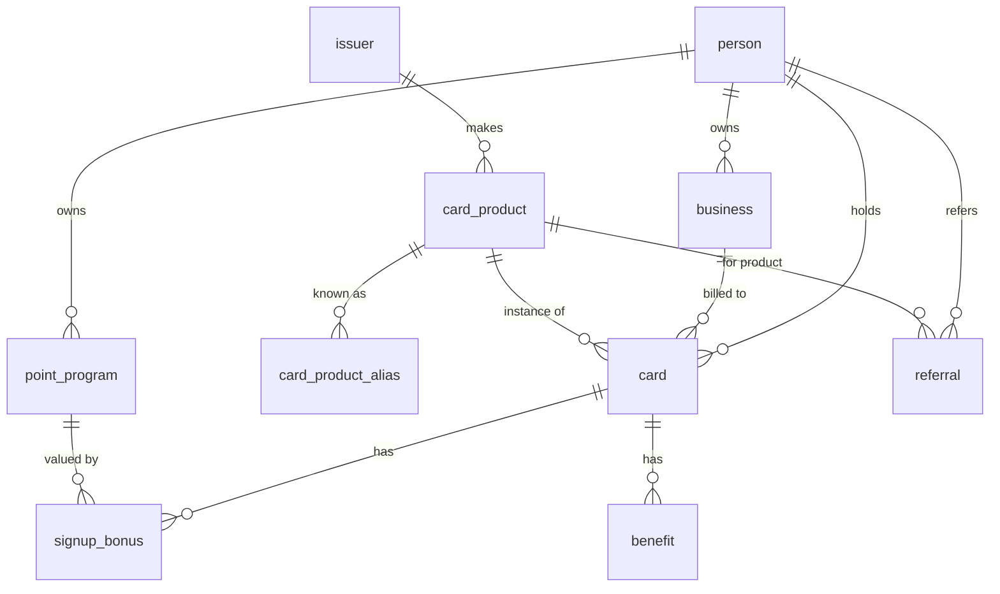

# Feature Map — Credit Card Manager

A local-first desktop app for tracking credit-card churning: cards, signup bonuses,
recurring benefits, annual-renewal cycles, 5/24 velocity, point valuations, multiple
people & businesses, and referrals. Replaces an unwieldy spreadsheet. Data lives in a
private SQLite file on your machine.

## Vision

- **Local & private.** No cloud, no account. SQLite in the OS app-data dir.
- **Easy to run.** Ships as a double-clickable installer (Electron) for non-technical family.
- **Value-aware.** Every bonus's worth is *computed* from point valuations, not hand-typed.
- **Low-friction onboarding.** Bootstrap your cards from a credit report; fill detail incrementally.

## Stack

Electron + React + TypeScript · SQLite (`better-sqlite3`) · Drizzle ORM + migrations ·
tRPC-over-IPC (typed main↔renderer) · Mantine + TanStack Table · `pdfjs-dist` (report parsing) ·
Fuse.js (fuzzy matching) · electron-builder (installers).

## Entities

| Entity | Purpose |
|---|---|
| `person` | A human you manage (you, spouse, …) |
| `business` | A business owned by a person (multiple per person); for business cards |
| `issuer` | Card issuer (Chase, Amex, …) — drives issuer-level rules later |
| `card_product` | The **catalog**: a known product. Fuzzy-match target for import + future suggestions source |
| `card_product_alias` | Report-name variants for fuzzy matching |
| `card` | An actual account you hold/applied for. **Mostly nullable** so it can be a partial stub |
| `point_program` | A loyalty currency with an owner + **valuation (cents/point)** + optional balance |
| `signup_bonus` | Per-card bonus: spend target, deadline, progress; value **computed** from points × cpp |
| `benefit` | Recurring perk/credit with use-after/use-by window, used/confirmed flags |
| `referral` | Referral between people, with link, reward, status |

Conventions: money is integer **cents**; point valuation is **cents-per-point**; dates are ISO
`YYYY-MM-DD` text; booleans are real booleans. See `src/main/db/schema.ts`.

## Features by phase

**v1**

- [x] **P0 — Scaffold:** Electron shell, SQLite + migrations + seed catalog, typed IPC, nav UI, dashboard. ✅
- [x] **P1 — Entities & catalog CRUD + "Needs info" inbox:** People, Businesses, Issuers, card-product
  catalog (seeded), Cards (create/edit, lifecycle status). A **derived** inbox lists cards missing
  churning-critical fields and walks you through filling them. ✅
- [x] **P2 — Bonuses & points:** Point programs with valuations (+ balances); signup bonuses with
  computed value, on-track / remaining, received/used flags. ✅
- [x] **P3 — Benefits:** Recurring perks with windows, used/confirmed/subscription flags; status
  filter (available / upcoming / used / expired) and inline "used" toggle. ✅
- [x] **P4 — Velocity & referrals:** 5/24 view per person (computed from open dates); referrals
  between people; rejected applications surfaced. ✅
- [x] **P5 — Credit-report importer (Experian PDF):** parse tradelines, fuzzy-match to the catalog
  issuer, create a card for **every** tradeline (stub if low confidence), then route gaps to the
  Needs-info inbox. Verified against the real 22-account sample. ✅
- [x] **P6 — Export & backup:** **CSV per table** plus a **full JSON snapshot** that doubles as a
  portable, restorable backup, and **restore-from-JSON**. Round-trip verified (369 rows). Follow-on:
  multi-sheet Excel (`.xlsx`) workbook export. ✅
- [x] **P7 — Packaging:** electron-builder produces an (unsigned) installer/app; native module rebuilt
  for Electron, migrations shipped as resources. ✅

**Designed-now, built-later**

- **Suggestions engine** ("open which card, when"): reads velocity + open/closed/rejected history +
  renewal dates + offers. The `card_product` catalog is already the recommendation source. A future
  `product_offer` table will hold current best offers.

**Deferred (other spreadsheet areas)**

- Bank-account bonuses, cashback apps (Rakuten/TopCashback), point transfer partners, travel credits,
  payment planning, custom multi-person velocity buckets, multi-bureau import.

## Completeness model (why there's no "complete?" flag)

A card never blocks on missing data — the importer and manual entry both create partial stubs. Rather
than store a stale "complete" flag, the app **derives** each card's missing-info list at query time
against the fields that matter for churning (catalog match, owner, annual fee, open date,
statement/payment days, "has a bonus?"). That list powers the **Needs-info inbox**.

## Credit-report import notes (Experian)

The Experian PDF has a clean text layer. The Accounts section uses consistent labels we parse directly:
`Account Name` (→ fuzzy-match input), `Account Type` ("Credit card" filters loans), `Responsibility`
("Authorized user"/"Individual"), `Date Opened`, `Status`, `Credit Limit`. Account numbers are
prefix-masked (`490970XXXX…`), so **last-4 is not available from the report** — it stays a manual field.
Report names are usually **issuer-level**, so matching is strongest at the issuer; the exact product is
often a Needs-info field. (Equifax/TransUnion samples are website prints with broken pagination — not
parser targets.)
